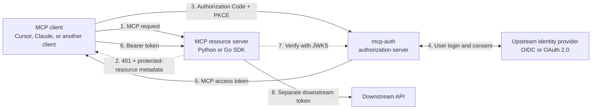

# mcp-auth

`mcp-auth` is a provider-neutral OAuth platform for HTTP-based Model Context Protocol (MCP) resource servers.

## Docker Hub

The standalone authorization-server image is published at
[`princekrroshan01/mcp-auth-server`](https://hub.docker.com/r/princekrroshan01/mcp-auth-server).
It is a minimal, non-root image containing only the Go authorization server:

```bash
docker pull princekrroshan01/mcp-auth-server:0.1.2
docker run --rm -p 8080:8080 \
  -e MCP_AUTH_ISSUER=http://localhost:8080 \
  -e MCP_AUTH_RESOURCE=http://localhost:8081/mcp \
  -e MCP_AUTH_LOCAL_DEVELOPMENT=true \
  -e MCP_AUTH_REQUIRE_HTTPS=false \
  princekrroshan01/mcp-auth-server:0.1.2
```

The example above is intentionally local-development-only. For a deployment,
pin an immutable release tag or digest, use HTTPS, mount a persistent signing
key and durable store, and configure an OIDC/OAuth connector. Do not put client
secrets, signing keys, or administrator credentials in an image or a public
Dockerfile. `latest` is published for non-prerelease releases for convenience,
but production deployments should use an explicit version or digest.

It separates three concerns that are often coupled:

- **MCP clients** complete standard Authorization Code + PKCE.
- **MCP resource servers** validate narrowly scoped access tokens with a reusable Python or Go SDK.
- **Identity providers and downstream APIs** stay behind runtime-configured connectors.

An OIDC provider (a connector requesting `openid`, with a verified ID token) and a
plain OAuth 2.0 provider (no `openid`, identity from `userinfo_endpoint`) are both
supported. Endpoints may be configured directly or discovered from the issuer, and
ID tokens may use RS256, PS256, or ES256. See
[OIDC or plain OAuth 2.0](docs/auth-server.md#oidc-or-plain-oauth-20).

## How it fits together



The token sent by the MCP client is valid only for the MCP resource server. It is
never forwarded to the downstream API. The resource server obtains a separate
downstream credential through token exchange or the connector's upstream session.

## Choose your starting point

- **Deploy the authorization server:** [Authorization server](docs/auth-server.md)
- **Protect an MCP resource server:** [Auth client SDKs](docs/auth-client.md)
- **Understand the complete protocol flow:** [Architecture](docs/architecture.md)
- **Run an end-to-end example:** [Demo MCP + Keycloak](docs/demo-example.md)
- **Contribute or run tests:** [Local development](docs/development.md)

The repository contains:

- `auth-server/`: a standalone Go OAuth authorization server.
- `auth-client/python/`: a reusable Python resource-server SDK, including a FastMCP adapter.
- `auth-client/go/`: a reusable Go resource-server SDK.
- `examples/demo-mcp/`: a dummy FastMCP resource server used by Compose E2E.

MCP authorization is optional at the protocol level. A resource server may still
require it when it exposes private data or actions.

## Architecture

The authorization server owns login, consent, client registration, token issuance,
refresh rotation, and connector selection. Resource servers remain independent:
they use the SDK to publish discovery metadata, return the correct bearer challenge,
validate JWTs locally from JWKS, and obtain downstream credentials when needed.

For sequence diagrams, credential boundaries, extension points, and deployment
topologies, see [Architecture](docs/architecture.md).

## Local setup

Requirements: Go 1.26+ and Python 3.12+.

```bash
python -m venv .venv
. .venv/bin/activate
python -m pip install -e '.[dev]'
(cd auth-server && GOWORK=off go test ./...) && (cd auth-client/go && GOWORK=off go test ./...)
pytest
```

Run the authorization server in local mode. It generates an ephemeral RSA key when no key file is configured; do not use that mode for production.

```bash
MCP_AUTH_LOCAL_DEVELOPMENT=true \
MCP_AUTH_REQUIRE_HTTPS=false \
MCP_AUTH_REGISTRATION_ENABLED=true \
(cd auth-server && GOWORK=off go run ./cmd/auth-server)
```

The default issuer is `http://localhost:8080`, the resource audience is `http://localhost:8081/mcp`, and metadata is available at `/.well-known/oauth-authorization-server`, `/.well-known/oauth-protected-resource`, and `/.well-known/jwks.json`.

## Packages

Python resource servers can use:

```python
from mcp_auth_client import JWTVerifier, RemoteAuthProvider, TokenExchangeClient

verifier = JWTVerifier(
    jwks_uri="https://auth.example.com/.well-known/jwks.json",
    issuer="https://auth.example.com",
    audience="https://mcp.example.com",
    required_scopes={"tools:read"},
)
```

Go resource servers can import `github.com/Agent-Hellboy/mcp-auth/auth-client/go/mcpauth` and use `mcpauth.JWTVerifier`, discovery helpers, and `TokenExchangeClient` from the `auth-client/go/v0.1.2` release. The authorization server module is `github.com/Agent-Hellboy/mcp-auth/auth-server` at `auth-server/v0.1.2`.

The Python SDK is currently installed directly from Git while its API settles:

```bash
python -m pip install "mcp-auth-client @ git+https://github.com/Agent-Hellboy/mcp-auth.git#subdirectory=auth-client/python"
```

The authorization server selects a provider-neutral connector at runtime with
`MCP_AUTH_CONNECTORS_FILE` and `MCP_AUTH_CONNECTOR`; the connector contains
endpoints and environment-variable names for secrets, never secret values.

Publishing a GitHub Release (`vX.Y.Z`) builds `auth-server` and pushes
`princekrroshan01/mcp-auth-server` to Docker Hub with that version tag, and
`latest` for non-prerelease versions.

## Development commands

```bash
ruff check .
ruff format --check .
mypy auth-client/python/src
pytest -q
(cd auth-server && GOWORK=off go test ./...) && (cd auth-client/go && GOWORK=off go test ./...)
(cd auth-server && GOWORK=off go vet ./...) && (cd auth-client/go && GOWORK=off go vet ./...)
uv run pip-audit --skip-editable
python -m build
docker compose -f deploy/docker-compose.e2e.yml up --build --abort-on-container-exit --exit-code-from e2e-client
docker compose -f deploy/docker-compose.e2e.yml down --volumes --remove-orphans
```

CI also runs local and production-mode Compose MCP OAuth compatibility flows with a mock OIDC issuer, Go vulnerability analysis, Python dependency auditing, a Trivy HIGH/CRITICAL scan of the authorization-server image, and the public-repository secret/artifact audit.

The compatibility checks cover the shared authorization flow used by the
2025-06-18 and 2026-07-28 MCP authorization specifications. The server emits
the newer authorization-response `iss` parameter by default; setting
`MCP_AUTH_AUTHORIZATION_RESPONSE_ISS=false` preserves the earlier response
shape for deployments that need it.

## Security model

- Authorization Code + PKCE (`S256`) is required for public clients.
- The token-exchange grant requires the caller to authenticate as a pre-registered
  resource server (RFC 7523 `private_key_jwt`) and presents only a `subject_token`
  this server itself issued; it is not an open relay to the upstream connector.
- Access tokens are short-lived `at+jwt` tokens with issuer, audience/resource, scopes, and unique IDs.
- Refresh tokens are opaque, hashed at rest, rotated on use, and revoked on reuse.
- OAuth state and credentials are abstracted behind persistence/key-provider interfaces; enterprise deployments should use shared durable storage plus a secret manager/KMS/HSM, not an unencrypted Docker volume. SQLite is suitable for a single auth-server instance; use a shared database adapter for multiple replicas.
- JWT verifiers are RS256-only, use bounded JWKS refreshes, and validate issuer, audience, expiry, `nbf`, and required scopes.
- Tokens are redacted from structured audit logs.
- Production deployments must use HTTPS, a persistent key provider, durable storage, restrictive CORS/trusted origins, and an upstream identity provider connector appropriate to the deployment.

## Demo resource server

`examples/demo-mcp` is a dummy MCP server. Compose E2E runs it with Keycloak as
the identity provider. See [docs/demo-example.md](docs/demo-example.md).

## Documentation

- [Architecture](docs/architecture.md)
- [Authorization server](docs/auth-server.md)
- [Auth client SDKs](docs/auth-client.md)
- [Demo MCP + Keycloak](docs/demo-example.md)
- [Local development](docs/development.md)

## Contributors

- Prince Roshan

## License

MIT. See [LICENSE](LICENSE).
