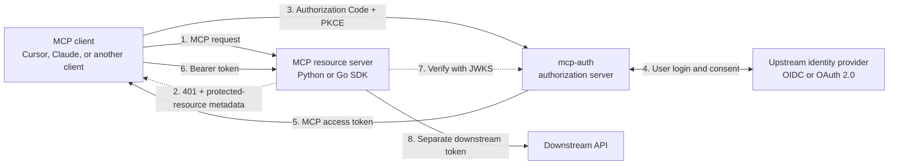

# mcp-auth

A provider-neutral OAuth platform for HTTP-based Model Context Protocol (MCP)
resource servers: a standalone authorization server, plus Python and Go SDKs for
the resource-server side.

It separates three concerns that are often coupled:

- **MCP clients** complete standard Authorization Code + PKCE.
- **MCP resource servers** validate narrowly scoped access tokens with a reusable
  Python or Go SDK.
- **Identity providers and downstream APIs** stay behind runtime-configured
  connectors.

Both an OIDC provider (a connector requesting `openid`, with a verified ID token)
and a plain OAuth 2.0 provider (no `openid`, identity from `userinfo_endpoint`)
are supported. Endpoints may be configured directly or discovered from the
issuer, and ID tokens may use RS256, PS256, or ES256. See
[OIDC or plain OAuth 2.0](docs/auth-server.md#oidc-or-plain-oauth-20).

## How it fits together



The token sent by the MCP client is valid only for the MCP resource server. It is
never forwarded to the downstream API; the resource server obtains a separate
downstream credential through token exchange or the connector's upstream session.

## Try it

```bash
docker run --rm -p 8080:8080 \
  -e MCP_AUTH_ISSUER=http://localhost:8080 \
  -e MCP_AUTH_RESOURCES=http://localhost:8081/mcp \
  -e MCP_AUTH_LOCAL_DEVELOPMENT=true \
  -e MCP_AUTH_REQUIRE_HTTPS=false \
  princekrroshan01/mcp-auth-server:0.2.0
```

Local-development only — no TLS, no identity provider. See
[Authorization server](docs/auth-server.md) before deploying it anywhere real.

## Choose your starting point

| I want to… | Read |
| --- | --- |
| Deploy the authorization server | [Authorization server](docs/auth-server.md) |
| Protect an MCP resource server | [Auth client SDKs](docs/auth-client.md) |
| Understand the protocol flow | [Architecture](docs/architecture.md) |
| Know what is guaranteed, and what I own | [Security model](docs/security-model.md) |
| Run an end-to-end example | [Demo MCP + Keycloak](docs/demo-example.md) |
| Contribute, run tests, or cut a release | [Local development](docs/development.md) |

## Repository layout

- `auth-server/` — standalone Go OAuth authorization server
  (`github.com/Agent-Hellboy/mcp-auth/auth-server`, tagged `auth-server/vX.Y.Z`)
- `auth-client/go/` — Go resource-server SDK
  (`github.com/Agent-Hellboy/mcp-auth/auth-client/go/mcpauth`, tagged
  `auth-client/go/vX.Y.Z`)
- `auth-client/python/` — Python resource-server SDK, including a FastMCP adapter
- `examples/demo-mcp/` — dummy FastMCP resource server used by the Compose E2E

The Python SDK installs from Git while its API settles:

```bash
python -m pip install "mcp-auth-client @ git+https://github.com/Agent-Hellboy/mcp-auth.git#subdirectory=auth-client/python"
```

MCP authorization is optional at the protocol level. A resource server may still
require it when it exposes private data or actions.

## Contributors

- Prince Roshan

## License

MIT. See [LICENSE](LICENSE).
