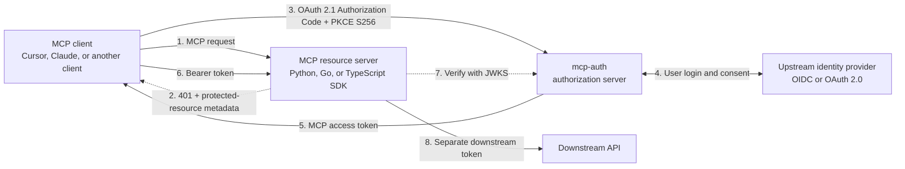

# mcp-auth

[](https://github.com/Agent-Hellboy/mcp-auth/actions/workflows/ci.yml)
[](https://github.com/Agent-Hellboy/mcp-auth/actions/workflows/codeql.yml)
[](SECURITY.md)
[](.github/workflows/ci.yml)
[](.github/workflows/ci.yml)
[](docs/auth-client.md)
[](auth-server/go.mod)
[](auth-client/go/go.mod)
[](.github/workflows/ci.yml)
[](pyproject.toml)
[](.github/workflows/ci.yml)
[](auth-client/typescript/package.json)
[](.github/workflows/ci.yml)
[](auth-client/typescript/package.json)
[](docs/architecture.md)
[](https://github.com/Agent-Hellboy/mcp-auth/releases)
[](https://hub.docker.com/r/princekrroshan01/mcp-auth-server)
[](LICENSE)

A provider-neutral OAuth 2.1 authorization broker for the Model Context Protocol
(MCP) ecosystem. mcp-auth sits between MCP clients and resource servers on one
side and an organization's upstream identity provider on the other. It provides
a standalone authorization server, plus Python, Go, and TypeScript SDKs for the
resource-server side.

It separates three concerns that are often coupled:

- **MCP clients** complete the OAuth 2.1 Authorization Code flow with mandatory
  PKCE S256.
- **MCP resource servers** validate narrowly scoped access tokens with reusable
  Python, Go, or TypeScript SDKs.
- **Identity providers and downstream APIs** stay behind runtime-configured
  connectors.

Both an OIDC provider (a connector requesting `openid`, with a verified ID token)
and a plain OAuth 2.0 provider (no `openid`, identity from `userinfo_endpoint`)
are supported. Endpoints may be configured directly or discovered from the
issuer, and ID tokens may use RS256, PS256, or ES256. See
[OIDC or plain OAuth 2.0](docs/auth-server.md#oidc-or-plain-oauth-20).

## Standards position

mcp-auth supports the MCP OAuth 2.1 authorization profile, including RFC 8414
Authorization Server Metadata, RFC 9728 Protected Resource Metadata, mandatory
PKCE S256, resource indicators and audience-bound tokens, refresh-token
rotation, RFC 9207 authorization-response `iss`, and optionally Client ID
Metadata Documents (CIMD), which are disabled by default and can be enabled by
configuration. Dynamic Client Registration remains available for compatibility.
The authorization server brokers
authorization; it is not an identity provider. MFA, directory policy, user
lifecycle, and upstream credentials belong to the upstream IdP.

mcp-auth does not claim to implement every OAuth extension or every
responsibility in the MCP specification. MCP clients, resource servers, and
authorization servers have distinct normative responsibilities; the bundled
authorization server and resource-server SDKs cover their respective roles.

## How it fits together



The token sent by the MCP client is valid only for the MCP resource server. It is
never forwarded to the downstream API; the resource server obtains a separate
downstream credential through token exchange or the connector's upstream session.

## Try it

```bash
docker run --rm -p 8080:8080 \
  -e MCP_AUTH_ISSUER=http://localhost:8080 \
  -e MCP_AUTH_RESOURCES=http://localhost:8081/mcp \
  -e MCP_AUTH_LOCAL_DEVELOPMENT=true \
  -e MCP_AUTH_REQUIRE_HTTPS=false \
  princekrroshan01/mcp-auth-server:0.3.0
```

Local-development only — no TLS, no identity provider. See
[Authorization server](docs/auth-server.md) before deploying it anywhere real.

## Choose your starting point

| I want to… | Read |
| --- | --- |
| Deploy the authorization server | [Authorization server](docs/auth-server.md) |
| Protect an MCP resource server | [Auth client SDKs](docs/auth-client.md) |
| Understand the protocol flow | [Architecture](docs/architecture.md) |
| Know what is guaranteed, and what I own | [Security model](docs/security-model.md) |
| Run an end-to-end example | [Demo MCP + Keycloak](docs/demo-example.md) |
| Build a Node.js MCP server | [TypeScript example](examples/typescript-mcp) |
| Build a Go MCP server | [Go example](examples/go-mcp) |
| Contribute, run tests, or cut a release | [Local development](docs/development.md) |

## Repository layout

- `auth-server/` — standalone Go OAuth authorization server
  (`github.com/Agent-Hellboy/mcp-auth/auth-server`, tagged `auth-server/vX.Y.Z`)
- `auth-client/go/` — Go resource-server SDK
  (`github.com/Agent-Hellboy/mcp-auth/auth-client/go/mcpauth`, tagged
  `auth-client/go/vX.Y.Z`)
- `auth-client/python/` — Python resource-server SDK, including a FastMCP adapter
- `auth-client/typescript/` — TypeScript resource-server SDK for Node.js
- `examples/demo-mcp/` — dummy FastMCP resource server used by the Compose E2E
- `examples/typescript-mcp/` — protected TypeScript MCP JSON-RPC server
- `examples/go-mcp/` — protected Go MCP JSON-RPC server

The Python SDK installs from Git while its API settles:

```bash
python -m pip install "mcp-auth-client @ git+https://github.com/Agent-Hellboy/mcp-auth.git#subdirectory=auth-client/python"
```

MCP authorization is optional at the protocol level. A resource server may still
require it when it exposes private data or actions.

## Contributors

- Prince Roshan

## License

MIT. See [LICENSE](LICENSE).
