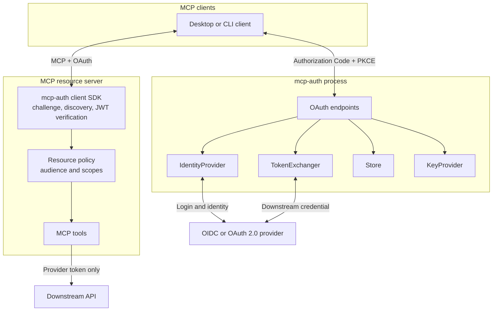
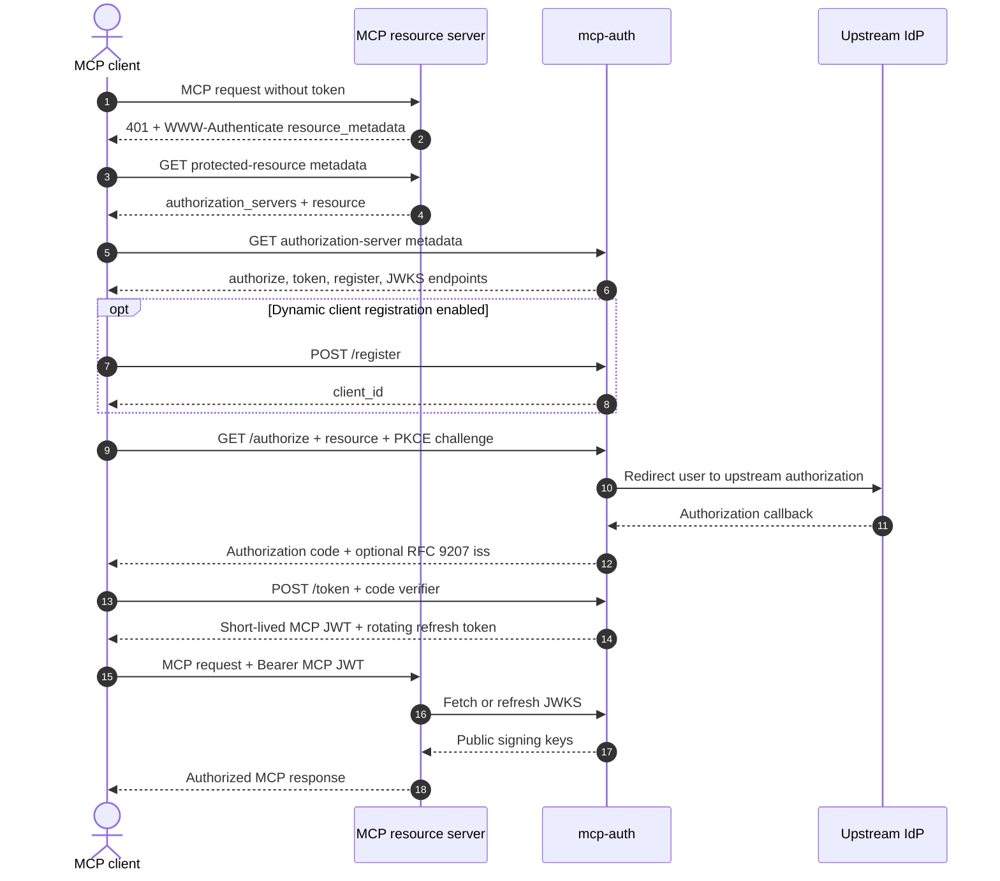
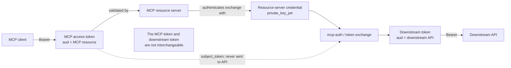
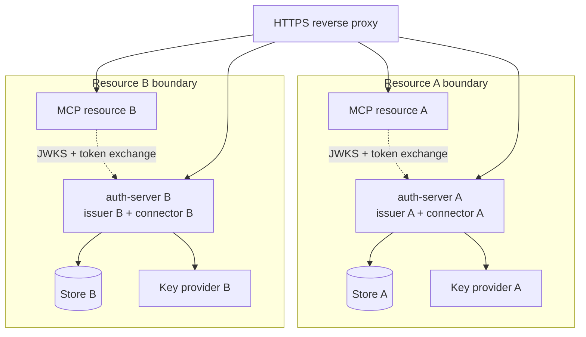

# Architecture

`mcp-auth` keeps protocol authorization, resource-server enforcement, and
provider-specific behavior behind explicit boundaries. The authorization server and
SDKs can be deployed independently; neither requires MCP tool handlers to know which
identity provider authenticated the user.

## Components

`auth-server` is an independently deployable Go OAuth authorization server. It owns authorization codes, consent, access-token signing, refresh-token rotation, client registration, and authorization-server metadata.

`auth-client/python`, `auth-client/go`, and `auth-client/typescript` are
resource-server SDKs. They validate access tokens issued by any compatible
authorization server and provide discovery, challenge, and token-exchange
helpers. They do not require the bundled authorization server.

Provider integrations implement `IdentityProvider` or `TokenExchanger` interfaces. Provider-specific claims, SDKs, and policy remain outside the core server and SDKs.

## MCP request flow

The resource server validates the token's signature, issuer, audience/resource,
expiry, subject, and required scopes before dispatching an MCP tool. Authorization
is optional in MCP itself; each resource server decides whether its data or actions
require it.

Compatibility follows the shared authorization flow in the [2025-06-18 MCP authorization specification](https://modelcontextprotocol.io/specification/2025-06-18/basic/authorization) and the [2026-07-28 specification](https://modelcontextprotocol.io/specification/2026-07-28/basic/authorization). Newer issuer-response validation is additive, so deployments can support clients from either version. The 2026-07-28 client-registration change is also implemented: an HTTPS URL `client_id` is fetched as an OAuth Client ID Metadata Document, and dynamic client registration remains for clients that do not use one. See [Client ID Metadata Documents](auth-server.md#client-id-metadata-documents).

## Token boundaries

There are three different credentials:

| Credential | Issued for | Allowed use |
| --- | --- | --- |
| MCP client token | The MCP resource server | Inbound resource-server authorization |
| Resource-server service credential | A downstream authorization server/API | Server-to-server authentication |
| Downstream API token | The downstream API audience | Requests to that downstream API only |

The resource server must never forward the MCP client token to an API with a different audience. Use RFC 8693 token exchange or another provider adapter to mint a separate downstream token. Under the default `upstream_session` strategy the exchange response includes `issued_token_type`, and `audience`, `scope`, and `requested_token_type` are advisory: the credential is the one captured at login, not a newly minted audience-scoped token.

`private_key_jwt` proves which resource server is requesting exchange. It does not
identify the end user; the validated MCP token remains the subject credential.

## Extensibility

- `Store` allows durable persistence without changing handlers. OAuth state belongs in a shared managed store for multi-instance deployments.
- `KeyProvider` allows KMS/HSM or secret-manager-backed signing and JWKS publication; local PEM/ephemeral keys are for development only.
- `IdentityProvider` allows local development, OIDC, SAML-backed login, or another user system.
- `TokenExchanger` allows RFC 8693 or provider-specific downstream exchange.
- SDK discovery objects accept third-party authorization-server metadata.
- FastMCP is optional in the Python package; non-FastMCP servers can use the verifier and challenge helpers directly.

## Deployment topology

One `auth-server` process has one issuer, one selected connector, and one canonical
resource audience. Deploy multiple processes when protecting multiple resources.
That keeps client registrations, consent state, signing keys, and upstream sessions
from accidentally crossing resource boundaries.

For exact runtime settings and operational constraints, see
[Authorization server](auth-server.md). For SDK integration, see
[Auth client SDKs](auth-client.md).
