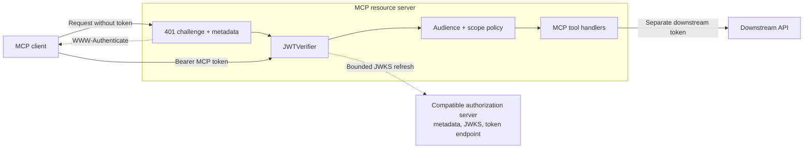
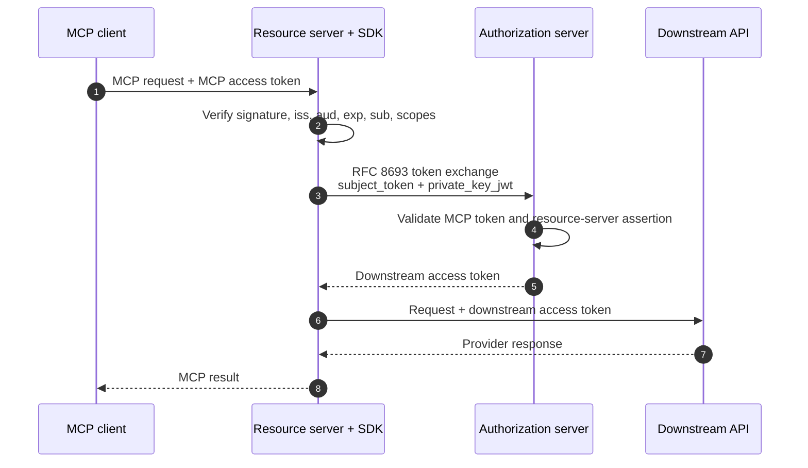

# Auth client SDKs

Both SDKs are installable without the authorization server. They work with the bundled server or a third-party OAuth authorization server that publishes compatible metadata.

The SDK is the authorization boundary inside a resource server. MCP tool handlers
receive a verified subject and scopes; they do not parse bearer tokens, fetch JWKS,
or know which identity provider authenticated the caller.



The Python package is currently Git-installable (a VCS pin is appropriate until
the package is published to an index):

```bash
python -m pip install "mcp-auth-client @ git+https://github.com/Agent-Hellboy/mcp-auth.git#subdirectory=auth-client/python"
```

## Python

```python
from mcp_auth_client import JWTVerifier, RemoteAuthProvider

verifier = JWTVerifier(
    jwks_uri="https://auth.example.com/.well-known/jwks.json",
    issuer="https://auth.example.com",
    audience="https://mcp.example.com",
    required_scopes={"tools:read"},
)
auth = RemoteAuthProvider(
    token_verifier=verifier,
    authorization_servers=["https://auth.example.com"],
    base_url="https://mcp.example.com",
).build()
```

Install the FastMCP extra only when using FastMCP. Otherwise call `JWTVerifier.verify` and return `unauthorized_headers(...)` from the resource server's 401 response.

The verifier allowlists RSA SHA-2 algorithms, refreshes JWKS on a bounded schedule, validates `iss`, `aud`, `exp`, `sub`, and required scopes, and rejects unknown signing keys.

`build_remote_auth`, `build_exchange_client`, `public_base_url`,
`TokenExchangeError`, and `ExchangedToken` are part of the SDK itself. The
`ssrf_safe` option controls the JWKS fetch policy: safe mode requires HTTPS for
non-loopback endpoints and rejects credential-bearing or non-loopback IP URLs;
disable it only for a controlled local test transport.

## Go

Import `github.com/example/mcp-auth/auth-client/go/mcpauth`, configure `JWTVerifier`, and use `DiscoverProtectedResource`, `DiscoverAuthorizationServer`, `ParseWWWAuthenticate`, and `TokenExchangeClient`. The Go SDK uses the standard library and supports bounded token caching.

## Discovery and third-party providers

Resource servers should publish Protected Resource Metadata with `authorization_servers`. Clients then fetch `/.well-known/oauth-authorization-server` from the selected issuer. The SDK metadata dataclasses and structs accept provider-neutral endpoints, optional DCR, optional revocation, and provider-specific scope sets without changing MCP tools.

The repository includes a Docker Compose E2E flow with the real resource-server
submodule, deployable `mcp-auth`, a mock OIDC issuer, a runtime key helper, and
an SDK client. It covers both MCP authorization response variants, consent,
PKCE, JWT/JWKS validation, token exchange and audience separation, refresh
rotation, revocation, invalid-token rejection, and MCP initialization. Run it with:

```bash
docker compose -f deploy/docker-compose.e2e.yml up --build --abort-on-container-exit --exit-code-from e2e-client
docker compose -f deploy/docker-compose.e2e.yml down --volumes --remove-orphans
```

## Token exchange

`TokenExchangeClient` sends RFC 8693 parameters and returns a token tagged with the requested downstream audience. Cache keys are bounded and include subject-token identity, audience, and scope. The returned token is a new downstream credential; do not substitute the inbound MCP client token. Keep these boundaries explicit: the MCP client token authenticates the caller to the resource server, the resource server's service credential authenticates its exchange request, and the downstream API token authenticates the provider call.



The SDK cache is keyed by subject-token identity, requested audience, and scope.
It never turns an MCP token into a generic bearer credential, and it never sends
the resource server's private key to the authorization server.

## Private-key JWT

`PrivateKeyJWTClientAuth` creates short-lived `client_assertion` JWTs with `iss`, `sub`, `aud`, `iat`, `exp`, `jti`, and `kid`. Keep the private key outside the repository and load it from a secret manager or file with restrictive permissions.

## Extension points

Implement a provider adapter around the SDK's metadata and HTTP interfaces when a third-party authorization server has non-standard registration or exchange behavior. Keep the adapter at the application edge; MCP tool handlers should receive verified subject/scopes and never know which provider issued the token.
