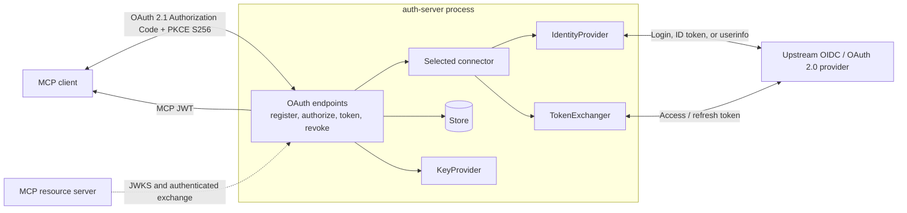
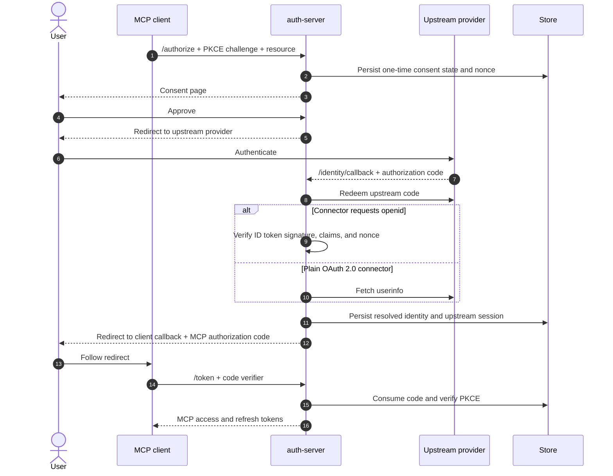
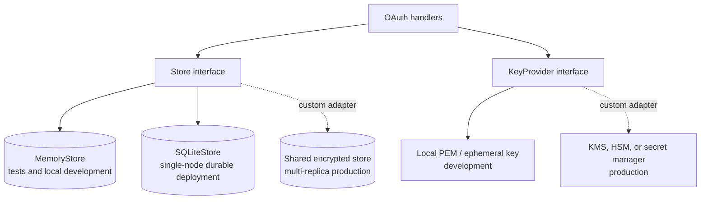
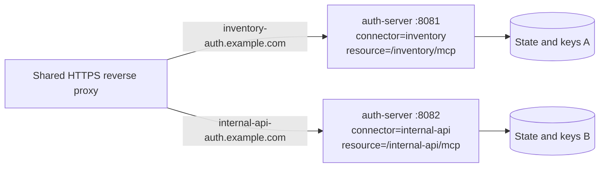

# Authorization server

The Go authorization server presents standard OAuth endpoints to MCP clients and
adapts a selected upstream OIDC or OAuth 2.0 provider at runtime. One process is
bound to one connector and one MCP resource audience.

## Standards and compatibility

The server supports the MCP OAuth 2.1 authorization profile: RFC 8414
Authorization Server Metadata, RFC 9728 Protected Resource Metadata, mandatory
PKCE S256, resource indicators and audience-bound tokens, refresh-token
rotation, RFC 9207 authorization-response `iss`, and Client ID Metadata
Documents (CIMD), enabled by default. Set
`MCP_AUTH_CLIENT_ID_METADATA_ENABLED=false` to opt out; metadata reports
support according to that setting. Dynamic Client Registration remains available as a fallback
and is disabled by default; set `MCP_AUTH_REGISTRATION_ENABLED` to enable it.
Clients should use pre-registered credentials when available, otherwise prefer
CIMD when advertised and fall back to DCR only when CIMD is unavailable. CIMD
does not invoke DCR after success: its HTTPS metadata URL is the client ID and
the authorization server resolves it directly.
Compatibility follows the MCP
specification versions described in the
[architecture guide](architecture.md#standards-and-roles).

mcp-auth is an authorization broker, not an identity provider. MFA, directory
policy, user lifecycle, and upstream credentials remain the responsibility of
the configured upstream IdP. This implementation does not claim every OAuth
extension or every MCP specification responsibility; clients, resource
servers, and authorization servers each have distinct normative roles.



## Run and configure

```bash
go run ./auth-server/cmd/auth-server
```

Release tags are also published to Docker Hub as
[`princekrroshan01/mcp-auth-server`](https://hub.docker.com/r/princekrroshan01/mcp-auth-server),
a minimal non-root image containing only the Go authorization server:

```bash
docker run --rm -p 8080:8080 \
  -e MCP_AUTH_ISSUER=http://localhost:8080 \
  -e MCP_AUTH_RESOURCES=http://localhost:8081/mcp \
  -e MCP_AUTH_LOCAL_DEVELOPMENT=true \
  -e MCP_AUTH_REQUIRE_HTTPS=false \
  princekrroshan01/mcp-auth-server:0.3.0
```

That command is local-development-only: it disables TLS and the upstream
identity provider. A deployment pins an immutable tag or digest, serves HTTPS,
mounts a persistent signing key and durable store, and configures a connector.
`latest` is published for non-prerelease versions, but pin a version or digest
in production. Never bake client secrets, signing keys, or administrator
credentials into an image or a public Dockerfile.

Copy `.env.example` to a local, untracked `.env` only if useful. The server reads `MCP_AUTH_*` variables; production should inject them through the deployment environment or a secret manager.

Important settings:

- `MCP_AUTH_ISSUER`: stable HTTPS issuer URL, used in metadata and `iss`. A trailing slash is stripped at
  startup; every endpoint the server builds or advertises (`/authorize`, `/token`, `/register`, `/revoke`,
  `/.well-known/jwks.json`, `/identity/callback`) is derived from the normalized value via one method each
  on `Config` — never by concatenating `Issuer` at the point of use — so the advertised endpoint and the one
  actually checked against can't independently drift the way they did before this existed.
- `MCP_AUTH_LOG_LEVEL`: `info` (default) logs one line per request — method, path, status, duration, and
  `client_id` where the request carries one — so a failed connection attempt can be diagnosed from the log
  alone. Set to `silent` to disable it for a deployment that wants quieter logs. This is separate from the
  structured OAuth event audit log, which always runs and always redacts tokens/secrets/codes/keys/assertions.
- `MCP_AUTH_RESOURCE`: canonical resource audience placed in `aud`.
- `MCP_AUTH_TRUST_PROXY_TLS`: default `false`. Set `true` only when a trusted
  reverse proxy terminates TLS in front of this process, overwrites inbound
  `X-Forwarded-*` headers, and is the **only** route to it. `X-Forwarded-Proto`
  is client-supplied, so without this the server ignores it and
  `MCP_AUTH_REQUIRE_HTTPS` means real TLS on the listener. Turning it on
  without restricting network access to the proxy lets any caller that can
  reach the process satisfy the HTTPS requirement by setting one header.
- `MCP_AUTH_RESOURCES`: comma-separated resource allow-list placed in `aud`; use this for multi-resource deployments.
- `MCP_AUTH_RESOURCE`: legacy single-resource setting, retained for compatibility when `MCP_AUTH_RESOURCES` is unset.
- `MCP_AUTH_PRIVATE_KEY_FILE`: PEM RSA key path. Local mode generates an ephemeral test key.
- `MCP_AUTH_STORE`: `memory` for tests/local development or `sqlite` for durable single-node deployments.
- `MCP_AUTH_DATABASE_URL`: SQLite path when `MCP_AUTH_STORE=sqlite`.
- `MCP_AUTH_CONNECTORS_FILE`: JSON file containing named upstream connectors.
- `MCP_AUTH_CONNECTOR`: selected connector name. One running process serves exactly one connector and one
  `MCP_AUTH_RESOURCE`, by design — see [Serving multiple resources](#serving-multiple-resources) below for
  more than one. Any other connector in the file is inert, and is named in a startup warning so it can't be
  mistaken for live. Local identity/token exchange is available only when `MCP_AUTH_LOCAL_DEVELOPMENT=true`;
  production starts only with a named connector. While the fixed-subject identity provider or the local
  token exchanger is in use, the process logs a warning at startup, again every minute, and on every
  use. The loopback-issuer and memory-store guards still refuse to boot a non-loopback issuer or a
  production memory store.
- `MCP_AUTH_REGISTRATION_ENABLED`: disable open registration unless policy permits it. Defaults to
  `false`, but Cursor and Claude both perform dynamic client registration (`POST /register`) before
  their first connection, with no fallback to a pre-registered client. A real deployment serving
  either of them must set this to `true`, or the first connection attempt fails with no obvious
  cause pointing back to this setting. Combine it with `AllowedClientRedirectURIs` (below) rather
  than leaving registration fully open if the deployment can enumerate its expected clients.
- `MCP_AUTH_IDENTITY_CALLBACK_URL`: the redirect URI registered with the identity provider. Empty
  derives it as `<MCP_AUTH_ISSUER>/identity/callback`. Set it to reuse a URI the provider already
  accepts; the callback is then served at that path too, so your ingress has to route it here. See
  [The redirect URI you register with your identity provider](#the-redirect-uri-you-register-with-your-identity-provider).
- `MCP_AUTH_CLIENT_ID_METADATA_ENABLED`: accept an https URL as a `client_id` and fetch the OAuth
  Client ID Metadata Document it names. Defaults to `true` for MCP client compatibility. Set it to
  `false` to disable CIMD; metadata then reports CIMD as unsupported and URL `client_id` values are
  rejected as unknown clients. Fetches are bounded and restricted to public HTTPS destinations.
- `MCP_AUTH_CLIENT_ID_METADATA_HOSTS`: comma-separated hosts a metadata document may be fetched
  from. Empty allows any public host. Non-public destinations are refused at dial time regardless,
  after resolution, so a hostname pointing at a private range cannot be reached.
- `MCP_AUTH_ALLOWED_SCOPES`: space-independent comma-separated scope allowlist.
- `MCP_AUTH_TRUSTED_ORIGINS`: exact CORS origins; keep this restrictive.
- `MCP_AUTH_REQUIRE_HTTPS`: enable outside local development. With a plain-HTTP `MCP_AUTH_ISSUER`,
  the upstream redirect_uri this server registers becomes `http://.../identity/callback`, which most
  providers (including Databricks) reject for anything other than `localhost`/`127.0.0.1`. An
  HTTP issuer only works for local development or behind an SSH tunnel to loopback.
- `MCP_AUTH_LOCAL_CLIENT_ID`: local-development-only pre-registered client used by
  the Compose token-exchange test; leave it empty outside local development.
- `MCP_AUTH_RESOURCE_CLIENTS_FILE`: JSON array of resource servers pre-provisioned to
  authenticate the token-exchange grant with RFC 7523 `private_key_jwt`. Each entry
  is `{"client_id", "name", "public_key_pem"}` or `{"client_id", "name", "public_key_file"}`
  (exactly one of the last two), plus an optional `"algorithm"` (`RS256` default, or
  `PS256`/`ES256` — must match the key's own type). A resource server's own private
  key never appears here; only its public key is registered, so the auth server can
  verify the `client_assertion` it presents on every token-exchange request, signed
  with exactly the algorithm it registered — not any algorithm this server happens
  to support, so a client can't switch algorithms without re-registering its key.

The Dockerfile builds a static, non-root image. Put TLS termination in a trusted reverse proxy or serve the endpoints through an HTTPS gateway.

## The redirect URI you register with your identity provider

Before a single login works, your identity provider has to know where to send
the browser back to. That value is the one piece of configuration that lives
outside this server, so get it right first.

**By default the URI is your issuer plus `/identity/callback`:**

| `MCP_AUTH_ISSUER` | Register this redirect URI |
| --- | --- |
| `https://auth.example.com` | `https://auth.example.com/identity/callback` |
| `https://mcp.example.com/auth` | `https://mcp.example.com/auth/identity/callback` |
| `http://127.0.0.1:8080` (local dev) | `http://127.0.0.1:8080/identity/callback` |

It is a redirect URI for **this server**, not for the MCP client and not for
the MCP resource server. Clients never see it. Most providers match it exactly,
including the trailing path and the scheme, so copy it rather than retyping it.

### When you cannot add a redirect URI

Often that URI is not yours to choose. The OAuth app already exists with a
fixed redirect URI, another team administers the provider, or change control
makes adding one slow. `MCP_AUTH_IDENTITY_CALLBACK_URL` points this server at a
URI the provider **already accepts**, so you can adopt mcp-auth without
touching the provider:

```bash
MCP_AUTH_ISSUER=https://mcp.example.com/auth
MCP_AUTH_IDENTITY_CALLBACK_URL=https://mcp.example.com/legacy/oauth/callback
```

The callback handler is then served at the override's path as well as the
default one, so the redirect lands on this server either way. Two consequences
to plan for:

- **Your ingress must route that path here.** If the override is
  `https://mcp.example.com/legacy/oauth/callback`, then `/legacy/oauth/callback`
  has to reach this container, not whatever else sits under that prefix. Pick a
  path that does not collide with another service's route.
- **It must name a path.** A bare origin is rejected at startup, because there
  would be nothing to route.

The value is validated when the process starts: absolute URL, no fragment, and
HTTPS unless `MCP_AUTH_REQUIRE_HTTPS=false`. A bad value fails the boot rather
than the first login.

### Checking it

The redirect URI this server will actually send is derived from the same
config the handler is mounted from, so an approved consent redirects straight
to the provider with it in the query string:

```bash
curl -si "$ISSUER/authorize?client_id=...&response_type=code&..." | grep -i location
# ...&redirect_uri=https%3A%2F%2Fmcp.example.com%2Flegacy%2Foauth%2Fcallback&...
```

If the provider answers with `invalid_redirect_uri` or an "unregistered
redirect" error, that string and the one registered with the provider differ.

## Metadata and keys

The server publishes:

- `/.well-known/oauth-authorization-server` and `/.well-known/openid-configuration`
- `/.well-known/oauth-protected-resource[/<resource path>]`
- `/.well-known/jwks.json`
- `/healthz` and `/readyz`

When the issuer is mounted under a path — `https://auth.example.com/mcp-auth` —
the authorization-server documents are **also** served at the RFC 8414 §3.1
path-insertion location, `/.well-known/oauth-authorization-server/mcp-auth`.
That is the URL clients actually request; serving only
`<issuer>/.well-known/oauth-authorization-server` makes discovery 404.

The protected-resource document is per resource. With several resources
configured, address one by its path — resource
`https://mcp.example.com/ping/mcp` is described at
`/.well-known/oauth-protected-resource/ping/mcp` — and the bare path returns
404, because answering it with an arbitrary entry would hand the client an
audience it did not ask for and its tokens would then be rejected by the server
it meant to call. With exactly one resource configured the bare path is
unambiguous and is served.

This endpoint is a convenience for deployments that put the authorization
server and the resource on one host. Canonically the document belongs to the
**resource server**, which is the only party that knows which scopes it
enforces; serve it from the client SDK instead
(`mcpauth.ProtectedResourceMetadataHandler` in Go,
`protected_resource_metadata` in Python). See
[auth-client.md](auth-client.md#publishing-protected-resource-metadata).

The configured RSA key signs RS256 access tokens. For key rotation, deploy a key provider that can publish the current and previous public keys in JWKS, issue tokens with a new `kid`, and remove old keys only after the maximum access-token lifetime plus clock-skew window. The sample server has one configured key slot and should be extended with a durable rotation provider before production.

## Client registration and consent

`POST /register` accepts `client_name`, exact `redirect_uris`, and `token_endpoint_auth_method`. Public clients use `none`; confidential clients may use client-secret authentication. Redirect URIs are matched exactly, and must take one of the shapes RFC 8252 (*OAuth 2.0 for Native Apps*) defines, since that is the profile MCP desktop clients follow:

- `https://` with a host — for example `https://claude.ai/api/mcp/auth_callback`.
- `http://` **only** on loopback: `127.0.0.1`, `[::1]`, or `localhost`. RFC 8252
  §7.3 requires both address families, because a client binding a loopback
  listener cannot know which one the OS will give it.
- A private-use URI scheme (RFC 8252 §7.1) — `claude://oauth/callback`,
  `cursor://…`, `com.example.app:/oauth/callback`. These have no meaningful
  authority component, so no host is required.

Plaintext `http://` to any non-loopback host is rejected. Admitting private-use
schemes broadly is safe because PKCE `S256` is mandatory and `/authorize`
matches a dynamically registered `redirect_uri` exactly. A deployment that
wants to restrict which clients may register sets the connector's
`allowed_client_redirect_uris`, which `/register` enforces when non-empty.

That allowlist is not exact-string for loopback. An `http` entry on
`127.0.0.1`, `localhost`, or `[::1]` matches scheme, hostname, and path, and
ignores the port (RFC 8252 §7.3), so `http://127.0.0.1:39999/callback` allows
`http://127.0.0.1:40000/callback` and does not allow `http://localhost:40000/callback`.
`http://127.0.0.1:*`, `http://localhost:*`, and `http://[::1]:*` match any path
on that host. `https` and private-use entries, including
`com.example.app:/oauth/callback`, still match the whole string. A fragment or
a relative URI is rejected both at registration and in the allowlist.

```json
"allowed_client_redirect_uris": [
  "http://127.0.0.1:*",
  "http://localhost:*",
  "http://[::1]:*",
  "https://claude.ai/api/mcp/auth_callback",
  "https://www.cursor.com/agents/mcp/oauth/callback",
  "claude://oauth/callback",
  "cursor://anysphere.cursor-mcp/oauth/callback",
  "com.example.app:/oauth/callback"
]
```

A rejected registration is an audit event `client_registration` with `outcome`
`failure`, `reason`, and `redirect_uri` when one was present. `/authorize` for
an unknown `client_id` is `authorization_rejected` with `reason`
`unregistered_client`. A redirect URI is not a credential, so it is logged.

### Client ID Metadata Documents

An MCP client may also identify itself with an HTTPS URL instead of calling
`POST /register`. That is an OAuth Client ID Metadata Document
(`draft-ietf-oauth-client-id-metadata-document-00`), which the 2026-07-28 MCP
authorization spec says an authorization server should support. Dynamic client
registration still works for clients that are not identified by a URL.

On `/authorize` and `/token`, a `client_id` that is an HTTPS URL is fetched and
checked: the document's `client_id` must equal that URL, every `redirect_uris`
entry must be a redirect this server would register, and the request's
`redirect_uri` must match one of them (loopback ports ignored, same as the
allowlist). `token_endpoint_auth_method` must be `none` or omitted. The same
`allowed_client_redirect_uris` list applies when it is set.

The fetch is HTTPS only, does not follow redirects, times out after 5 seconds,
and reads at most 1 MiB. URLs with userinfo or a fragment are rejected, as are
non-loopback IP literals. A hostname is not resolved, so a name that points at
a private address is not blocked. That is a real limit: the client chooses the
URL.

**A deliberate deviation from the MCP authorization spec.** That spec states
that "all redirect URIs MUST be either localhost or use HTTPS". Read literally
it excludes private-use schemes, and therefore excludes every desktop MCP
client that registers one — Cursor's `cursor://…` and Claude Desktop's
`claude://…` callbacks would both be refused, and neither could complete a
flow. RFC 8252 §7.1 defines private-use schemes precisely for native apps, and
the same document is what the spec's own native-app guidance points at, so this
server follows RFC 8252. The security property the spec's rule protects —
an authorization code cannot be redeemed by an attacker who intercepts the
redirect — is preserved by mandatory PKCE `S256` plus exact redirect matching.
Deployments that want the stricter rule set `allowed_client_redirect_uris` to
an explicit HTTPS/loopback allowlist.

`GET /authorize` requires `response_type=code`, `code_challenge_method=S256`, `code_challenge`, a resource from the configured allow-list, and a registered redirect URI. With one configured resource, `resource` may be omitted and defaults to it. It renders a consent page. In production, accepting consent redirects to the selected connector's upstream authorization endpoint and `/identity/callback` completes the upstream code flow. Local development also supports `approve=true` to exercise the flow without a browser.

### Consent page

The consent page is the only HTML document this server returns to a browser. It shows the MCP client by name, lists each requested scope, shows the resource the access token will be bound to, and says the user will be sent to the upstream identity provider to sign in. The form is `POST` to the issuer's consent endpoint (`ConsentEndpoint`, the issuer plus `/authorize/consent`) with a hidden `consent_id` and buttons named `decision` (`approve` or `deny`).

`client_name` from `POST /register` is the prominent heading. A dynamically registered client is labeled unverified, with the text "This name was supplied by the application and has not been verified." The `client_id` stays on the page for operators. Operator-provisioned clients are not given that label.

An optional `consent` object on the connector customizes the copy without replacing the template. When `consent` is omitted, the server uses its built-in page. `website_url` and `support_url`, when set, must be absolute `https` URLs. `http`, `javascript:`, `data:`, and protocol-relative URLs are rejected when the connector file is loaded.

```json
"consent": {
  "display_name": "Inventory",
  "website_url": "https://inventory.example.com",
  "page_title": "Authorize Inventory",
  "subtitle": "Inventory access needs your approval.",
  "intro_paragraphs": [
    "Review the application and the access it is requesting before you continue."
  ],
  "permissions": [
    "Read inventory records on your behalf"
  ],
  "scope_labels": {
    "tools:read": "Read data through MCP tools"
  },
  "upstream_sso_label": "Example IdP",
  "support_url": "https://inventory.example.com/support"
}
```

`display_name` is the service being authorized. `scope_labels` maps a scope token to a description; a scope with no label is shown as the raw scope string, one list item per scope. `permissions` is a plain-language list and is not matched against scope names. `upstream_sso_label` names the identity provider the user is sent to. When it is empty, the page says "the upstream identity provider".

The consent document and the expired-consent response (still HTTP 400) send:

- `Content-Security-Policy: default-src 'none'; style-src 'unsafe-inline'; form-action 'self'; frame-ancestors 'none'`
- `X-Frame-Options: DENY`
- `Referrer-Policy: no-referrer`
- `Cache-Control: no-store`

`style-src 'unsafe-inline'` is there because the stylesheet is a `<style>` element in the document. The page loads no scripts and no external assets. An expired consent request is an HTML page in that same layout, telling the user to return to the application and start again. It is not a plain-text error.

Connector files are keyed JSON objects. They contain upstream endpoints, client
IDs, requested scopes, MCP scopes, and `client_secret_env`—the name of an
environment variable, never a literal secret. `client_id` can likewise be
supplied indirectly as `client_id_env`; set exactly one of the two. All
provider-specific behavior is behind `IdentityProvider` and `TokenExchanger`
interfaces.

For a provider behind the same Kubernetes cluster, `token_endpoint_internal`
may point to its private Service URL so the auth server does not hairpin through
the public ingress. Keep the normal public `token_endpoint` for discovery and
set `token_endpoint_server_name` to the hostname covered by the provider's TLS
certificate. `jwks_uri_internal` can be set the same way when JWKS is not
reachable through the public ingress from the auth pod. The internal endpoints
must still use HTTPS in production.



A connector only needs `issuer` plus whichever of `authorization_endpoint`,
`token_endpoint`, `jwks_uri`, and `userinfo_endpoint` it doesn't want to
specify by hand: at load time, if any of the first three is missing, the
server fetches `{issuer}/.well-known/openid-configuration` (OpenID Connect
Discovery 1.0) once and fills in whichever fields the connector left blank.
The request sends `Accept: application/json`. The document's `issuer` must
match the issuer that was requested (OpenID Connect Discovery 1.0 §4.3); a
single trailing slash on either side is ignored, and any other difference
fails startup. A discovered `jwks_uri` may be on a different host than the
issuer. That is legitimate for some providers, and it also means discovery
can move key fetching to a host the connector file never named. A connector
that already specifies all three endpoints never triggers this — it's purely
additive, so every connector written before discovery existed keeps working
unchanged. A load-time failure to reach the discovery document is a startup
error, not a silent fallback.

`identity_claims` is the ordered list of ID token claims tried, in order, as
the local identity (`Identity.Subject`): defaults to `["sub"]`. Not every
provider puts a usable identity in the ID token itself — some only expose
`email` or group membership via the userinfo endpoint, and `sub` is often an
opaque per-provider identifier a resource server has no other use for. If
none of `identity_claims` are present in the ID token and `userinfo_endpoint`
is known (explicit or discovered), it's called once with the upstream access
token — never the MCP client's own token — and its claims are merged in
before trying again; ID token claims always win over userinfo's on overlap,
since userinfo responses aren't signed the way ID tokens are.

`allowed_algorithms` lists which JWS algorithms this connector's ID tokens
may be signed with: any of `RS256`, `PS256`, `ES256`. Defaults to `["RS256"]`
when unset, matching every connector configured before this field existed —
a provider that signs with ES256 or PS256 needs it set explicitly.

`id_token_nonce_policy` defaults to `required`: mcp-auth sends a high-entropy
nonce to the upstream authorization endpoint and requires the same claim in the
returned ID token. `disabled` is a narrowly scoped provider-compatibility
setting for an upstream whose published discovery metadata/documentation shows
that its ID tokens do not carry `nonce`. It is not a general troubleshooting
switch: use it only after verifying that limitation, because it omits both the
request parameter and the ID-token check. The one-time, store-consumed upstream
`state` and S256 PKCE verifier remain mandatory.

For example, a Databricks connector may require this setting when its live
OIDC discovery advertises no `nonce` claim:

```json
{
  "id_token_nonce_policy": "disabled"
}
```

### OIDC or plain OAuth 2.0

Requesting the `openid` scope is what makes a connector OIDC, and that is how
the server decides what to require:

- **With `openid`** (including a connector that sets no `scopes` at all, since
  the authorization request defaults to `openid`): the provider must return an
  `id_token`, and it is verified — signature against the JWKS, issuer,
  audience, expiry, `iat`/`nbf`, and the nonce binding it to this request. A
  response with no `id_token` is an error, not a fallback: it means the
  provider misbehaved or someone removed `openid` from the scopes, and quietly
  accepting less verification is the wrong answer to either.
- **Without `openid`** (a GitHub-style OAuth 2.0 provider): there is no ID
  token, so identity comes from `userinfo_endpoint`, called once with the
  upstream access token and resolved through `identity_claims`. Such a
  connector must set `userinfo_endpoint` (directly or via discovery) and
  `identity_claims` naming a claim that endpoint actually returns, or startup
  succeeds and the first login fails. The state is still one-time and
  store-consumed, and PKCE still binds the code exchange; only the ID token's
  own nonce binding is absent, because there is no ID token.

`downstream_token_strategy` selects how a resource server's downstream
credential (the one it sends to the actual downstream API — Databricks, an
internal service, whatever the connector fronts) is obtained:

- `upstream_session` (the default): the token set the connector's upstream
  provider already issued at login is captured, persisted per subject, reused
  directly, and refreshed via `grant_type=refresh_token` when it expires. This
  works with any OAuth2/OIDC provider, since it never depends on the upstream
  supporting RFC 8693 token-exchange or trusting an mcp-auth-issued token as a
  federated subject. `audience`, `scope`, and `requested_token_type` on the
  exchange request are advisory. They are not minted into a new
  audience-scoped token. The response is still the credential the login
  session already produced, and it includes
  `issued_token_type` of `urn:ietf:params:oauth:token-type:access_token`
  (RFC 8693 §2.2.1) because that is the shape of the token being returned.
- `rfc8693`: performs RFC 8693 token-exchange against the connector's upstream
  provider, presenting this server's own access token as `subject_token`. Use
  this only against a provider that actually implements token-exchange (often
  requiring pre-configured issuer federation) and where a per-request,
  differently-scoped downstream token is genuinely needed.

If unsure which a specific upstream provider supports, start with
`upstream_session` — it needs nothing beyond what an ordinary Authorization
Code + PKCE login already requires.

A connector has two independent, optional redirect allowlists that are easy to
conflate because they're both "redirect URIs":

- `allowed_upstream_callback_uris`: which of this server's own
  `MCP_AUTH_ISSUER`-derived `/identity/callback` URLs may be used when
  registering with the connector's upstream provider. This guards the
  server's own registration, not an MCP client's redirect.
- `allowed_client_redirect_uris`: which `redirect_uris` an MCP client (Cursor,
  Claude Desktop, ...) may request through dynamic client registration or a
  Client ID Metadata Document, in addition to the redirect check `POST /register`
  always applies. Loopback `http` entries ignore the port;
  `http://127.0.0.1:*`, `http://localhost:*`, and `http://[::1]:*` match any
  path on that host. `https` and private-use entries match exactly.

## Verified identity providers

The server is provider-neutral by construction, but "neutral" is only a claim
until it is run against providers that share no code. These were verified end
to end — dynamic client registration, consent, upstream login, ID token
verification, `upstream_session` storage, MCP token issuance, and an
authenticated `tools/call` on a resource server — changing **nothing but the
connector entry**.

| Provider | Result | Notes |
| --- | --- | --- |
| Keycloak 26 | verified | Signs RS256. Sets session cookies `SameSite=None`, which forces `Secure`; browsers treat `http://localhost` as a secure context, non-browser test harnesses often do not. |
| Dex | verified | Signs RS256. `skipApprovalScreen: true` removes a second consent step that is redundant when this server already renders one. |
| GitLab CE 18 | verified | Signs RS256. Shows its own approval page on first authorization, then answers an already-authorized app with a *200 HTML redirect page* rather than a 302 — so a first run and a repeat run take different shapes. Its sign-in form is server-rendered entirely as `type="hidden"` inputs that Vue fills in, so field names (`user[login]`, `user[password]`) matter and input types do not. OAuth applications require an `organization_id` from GitLab 17 on. |
| Authelia | not supported on plaintext loopback | Refuses a cookie domain without a period and requires an HTTPS `authelia_url`. An Authelia policy, not a limitation here; it needs a dotted hostname and TLS. |

Each was driven through the same ten checks — dynamic client registration,
consent, upstream login, `/identity/callback`, token issuance, and an
authenticated `initialize`, `tools/list` and `tools/call` — twice per provider,
because several providers behave differently once an authorization is
remembered.

### Split public and internal endpoints

A connector's endpoints are configured individually, which matters more than it
first appears. The browser and this server usually reach a provider by
different names — the browser through a published address, this server over an
internal network — and only the browser-facing ones may be rewritten:

```json
{
  "issuer": "http://localhost:6350/realms/mcp",
  "authorization_endpoint": "http://localhost:6350/realms/mcp/protocol/openid-connect/auth",
  "token_endpoint": "https://keycloak.example.com/realms/mcp/protocol/openid-connect/token",
  "jwks_uri": "https://keycloak.example.com/realms/mcp/protocol/openid-connect/certs",
  "token_endpoint_internal": "https://keycloak.mcp-sentinel.svc.cluster.local:8443/realms/mcp/protocol/openid-connect/token",
  "jwks_uri_internal": "https://keycloak.mcp-sentinel.svc.cluster.local:8443/realms/mcp/protocol/openid-connect/certs",
  "token_endpoint_server_name": "keycloak.example.com"
}
```

`issuer` and `authorization_endpoint` must be what the **browser** resolves,
because `issuer` is compared against the ID token's `iss` claim and the user is
redirected to `authorization_endpoint`. `token_endpoint` and `jwks_uri` are
the public/discovered values. When public ingress is not reachable from the
auth pod, `token_endpoint_internal` and `jwks_uri_internal` override only the
back-channel URLs. `token_endpoint_server_name` controls TLS hostname
verification for those internal HTTPS calls.

Leaving the back-channel endpoints blank triggers discovery instead, which is
simpler — but discovery resolves them relative to `issuer`, so it only works
when one name reaches the provider from both sides.

### Loopback deployments

`localhost` and `127.0.0.1` are different strings to an issuer or audience
comparison even though they resolve to the same host, so `MCP_AUTH_ISSUER`,
`MCP_AUTH_RESOURCE`, the connector's `allowed_upstream_callback_uris`, the
redirect URI registered with the upstream provider, and the URL handed to the
MCP client must all agree on one spelling. Publishing a container port with
`-p 127.0.0.1:…` binds IPv4 only, so a client resolving `localhost` to `::1`
will fail to connect with no useful error.

## Persistence

`MemoryStore` is for local development and tests. `SQLiteStore` persists clients,
consent requests, authorization codes, and refresh-token hashes transactionally
for a single server instance. Refresh-token families are revoked together when
reuse is detected. A multi-replica production deployment must use a
shared managed database adapter implementing `Store`; the HTTP handlers do not
depend on SQLite. Authorization codes and consent state are one-time and
short-lived. Refresh tokens are opaque, hashed, rotated on use, and revoked when
reuse is detected.

**`upstream_sessions` is the one exception to "the store never holds a usable
secret."** The `upstream_session` downstream-token strategy needs to replay the
upstream provider's own access/refresh token later, so unlike every other
table it stores that token set directly, not a hash. Treat this table with the
same care as the signing key: it belongs in a store with encryption at rest
and restricted access, not an unencrypted Docker volume, and a leak of it is
equivalent to a leak of every affected user's downstream credential.



The store contains different classes of data:

- One-time authorization codes, consent state, and OAuth state.
- Hashed refresh tokens, with rotation and reuse detection.
- Dynamic client registrations.
- **Usable upstream access and refresh tokens** when
  `downstream_token_strategy=upstream_session`; protect these as credentials.

The local token exchanger exists only to make the development Compose flow
self-contained. It is not behind a build tag, because tests and the e2e flow
call it, and every use logs that it is minting a stub credential. Production
must inject a provider-backed `TokenExchanger` that validates the subject token
and obtains a credential for the downstream audience. An exchanger error that
is an upstream fault (network, HTTP 5xx, missing upstream session) is
`server_error` with status 502 or 503 and an `error_description`. `invalid_target`
is reserved for an audience the exchanger itself rejects. Both cases carry an
audit `reason`.

Do not use a Docker volume as the authoritative credential/state store for a multi-instance deployment. Volumes are node-local and create failover, backup, encryption, and access-control problems. A volume is acceptable only as a tightly controlled single-node development or explicitly managed single-node deployment choice. The enterprise default is a shared encrypted database for OAuth state and a secret manager/KMS/HSM for signing keys and confidential client credentials. Implement `Store` and `KeyProvider` adapters for the chosen services; the HTTP handlers do not change.

The built-in `LocalKeyProvider` wraps the development PEM loader and ephemeral generated key. Production should replace it with a `KeyProvider` backed by KMS/HSM signing or a secret manager with rotation support. The server never needs to persist raw refresh tokens or client secrets: it stores hashes, and the secret provider owns private key material.

## Serving multiple resources

One `auth-server` process serves **one connector** and an **allow-list of
resources**. `MCP_AUTH_RESOURCES` takes a comma-separated list; `/authorize`
and `/token` reject any `resource` parameter outside it, and each issued token
is bound to the single resource the client asked for. `MCP_AUTH_RESOURCE` is
the legacy single-value form, used only when `MCP_AUTH_RESOURCES` is unset.

`MCP_AUTH_CONNECTOR` still selects exactly one entry out of
`MCP_AUTH_CONNECTORS_FILE` even when that file defines several. A connectors
file with multiple entries is for choosing between them across deployments (a
staging connector and a production connector, say), not for one running server
to authenticate against several providers at once.

So: several resources behind one identity provider is a single process with
`MCP_AUTH_RESOURCES`. Several *identity providers* still needs one process
each.

To front more than one upstream provider, run one `auth-server` process per
provider — each with its own `MCP_AUTH_CONNECTOR`, `MCP_AUTH_RESOURCES`, and
`MCP_AUTH_LISTEN_ADDR` — behind a shared reverse proxy that routes by hostname
or path. Nothing in the current design prevents
this; it's an ordinary multi-instance deployment; only the routing in front
of it changes. For example, with Caddy routing by hostname:



```caddyfile
inventory-auth.example.com {
    reverse_proxy 127.0.0.1:8081
}

internal-api-auth.example.com {
    reverse_proxy 127.0.0.1:8082
}
```

Each backend is a separate `auth-server` process, e.g.:

```bash
MCP_AUTH_ISSUER=https://inventory-auth.example.com \
MCP_AUTH_RESOURCE=https://mcp.example.com/inventory/mcp \
MCP_AUTH_CONNECTOR=inventory \
MCP_AUTH_LISTEN_ADDR=127.0.0.1:8081 \
go run ./auth-server/cmd/auth-server &

MCP_AUTH_ISSUER=https://internal-api-auth.example.com \
MCP_AUTH_RESOURCE=https://mcp.example.com/internal-api/mcp \
MCP_AUTH_CONNECTOR=internal-api \
MCP_AUTH_LISTEN_ADDR=127.0.0.1:8082 \
go run ./auth-server/cmd/auth-server &
```

Each instance needs its own `MCP_AUTH_DATABASE_URL` (or its own credentials
to a shared database) so their client registrations, consent state, and
signing keys don't collide.

## Production checklist

- Use an HTTPS issuer and canonical resource URI.
- Terminate TLS on this process, or set `MCP_AUTH_TRUST_PROXY_TLS=true` **and**
  restrict network access so only the terminating proxy can reach it. The
  setting is a claim about your topology; a NetworkPolicy or equivalent is what
  makes the claim true.
- Use a secret-managed persistent signing key and a planned rotation process.
- Replace `MemoryStore` with a transactional durable implementation.
- Integrate a real `IdentityProvider` and define consent/session policy.
- Keep the consent-page response headers at the proxy (`Content-Security-Policy`, `X-Frame-Options: DENY`, `Referrer-Policy: no-referrer`, `Cache-Control: no-store`). `consent.website_url` and `consent.support_url` must be absolute HTTPS URLs; `http`, `javascript:`, `data:`, and protocol-relative values are rejected at startup.
- Restrict registration, scopes, CORS, and trusted origins.
- Set short access-token TTLs and monitor refresh-token reuse.
- Keep structured audit logs, with tokens, secrets, codes, keys, and assertions redacted.
- Add rate limits, CSRF protection at the user-login boundary, secure cookies, and reverse-proxy request limits.
- Verify resource audience in every resource server and never pass through inbound tokens downstream.
- Advertise every scope you enforce. A resource server whose protected-resource
  metadata omits `scopes_supported` gives clients nothing to request, so they
  request none and every call fails `403 insufficient_scope` — a failure that
  looks like broken authentication. Derive the document from the verifier
  rather than hand-writing it.
