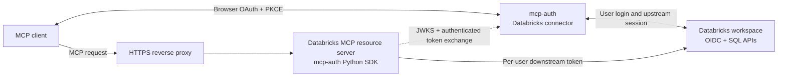

# Optional Databricks example

The Databricks example is optional and intentionally separate from the core. It is available as the public submodule configured in `.gitmodules`:

```bash
git submodule update --init --recursive
```

The core repository remains installable and testable when the submodule is absent. The companion provider-neutral fixture is in `examples/databricks-mcp-integration/`.



The example demonstrates integration boundaries, not a second OAuth
implementation. The resource server imports the SDK; all browser login, consent,
connector secrets, and upstream token state remain in `mcp-auth`.

## Generic configuration

The example's `.env.example` uses:

- `MCP_AUTH_ISSUER` and `MCP_AUTH_JWKS_URI` for discovery and JWT verification.
- `MCP_RESOURCE_AUDIENCE` for audience validation.
- `MCP_REQUIRED_SCOPES=tools:read` for read-only tools.
- `DOWNSTREAM_TOKEN_ENDPOINT` and `DOWNSTREAM_AUDIENCE` for optional exchange.

No real URLs, workspace identifiers, credentials, private keys, or deployment values belong in the example.

The external example currently imports the SDK through its historical module
name; the E2E image provides a compatibility alias to the installed
`mcp_auth_client` package. New integrations should import the public package
directly. The core repository no longer carries a separate SDK shim.

## Local Compose verification

The repository's Compose E2E job runs the real server from the optional submodule
alongside the bundled authorization server and the Python SDK client. It verifies
Protected Resource Metadata, the `401` bearer challenge, authorization-server
discovery, dynamic client registration, PKCE, consent, JWT validation, and MCP
initialization for both the earlier and later MCP authorization response shapes.

The Compose environment uses neutral placeholder workspace settings and does not
call a live Databricks workspace. A real workspace cannot be represented by dummy
credentials. Live downstream verification must be a separately gated deployment
using a secret manager, short-lived credentials, and a non-production workspace.

The Compose file uses an explicit configurable subnet to avoid Docker address-pool
exhaustion on hosts with many existing networks. Override it when necessary:

```bash
MCP_AUTH_E2E_SUBNET=172.31.240.0/24 \
MCP_AUTH_E2E_NETWORK=mcp-auth-e2e-alt \
docker compose -f deploy/docker-compose.e2e.yml up --build --abort-on-container-exit --exit-code-from e2e-client
```

## Policy

The example should expose read-only data tools, require `tools:read`, and derive per-user identity from the verified `sub` claim. A downstream API call must use a separate token minted for the downstream audience through `TokenExchangeClient` or a provider adapter. The inbound MCP client token must never be sent to that API.
