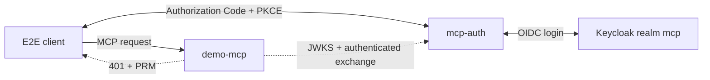

# Demo MCP resource server

The in-tree example at `examples/demo-mcp` is a dummy FastMCP resource server.
It exists so Compose can prove mcp-auth against a real HTTP MCP process without
shipping a vendor-specific product in this repository.

## What the Compose job verifies

`docker compose -f deploy/docker-compose.e2e.yml up --build --abort-on-container-exit --exit-code-from e2e-client`

starts:

1. Keycloak 26 with an imported `mcp` realm, user `e2e-user`, and confidential client `mcp-auth`.
2. The dummy resource server, protecting `/mcp` with the Python SDK.
3. mcp-auth with `downstream_token_strategy=upstream_session`, because Keycloak's
   ordinary login already issues the upstream token; RFC 8693 against Keycloak is
   not required for this check.

The client then exercises discovery, dynamic registration, PKCE, mcp-auth
consent, Keycloak username/password login, MCP JWT validation, authenticated
token exchange of the stored Keycloak session, refresh rotation, revocation,
and an authenticated `initialize`.

The Keycloak client secret in `tests/e2e/keycloak/realm.json` is a published
fixture (`e2e-client-secret`), not a production credential.

## Policy

The dummy server requires `tools:read` and never forwards the MCP access token
to another API. Downstream credentials come from mcp-auth token exchange using
the resource server's `private_key_jwt` key.
